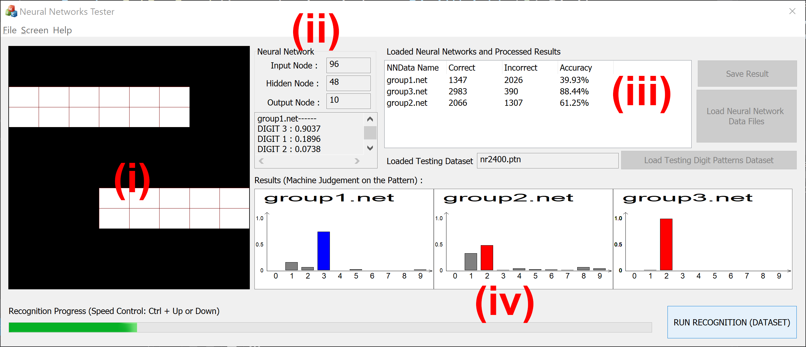

# DigitRecognitionTester (neural networks tester)

Interactive Digit Recognition Tester

This is created with Visual Studio 2019 using VC++.

It uses multiple 64bit external libraries (CSV parser). The library files are included under the subfolder (lib).

Testing datasamples are included in the folder (TestingDatasets)

